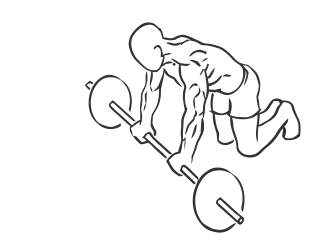
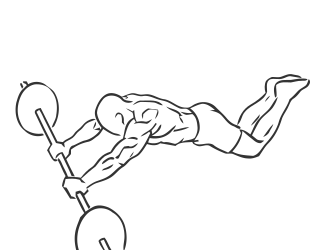

# Ab Rollout on Knees with Barbell

> This exercise works the abs and lower back and is the proper version of an “ab roller”.

``` 
id: 0286 
type: compound 
primary: abdominals 
secondary: erector spinae,deltoid 
equipment: barbell 
``` 


## Steps


 - This exercise works the abs and lower back and is the proper version of an “ab roller”. This version is performed on your knees.
 - Place a barbell on the floor in front of you.
 - Start by kneeling in front of the bar, grip the barbell with a shoulder with overhand grip.
 - With a slow controlled motion, roll the bar out so that your back is straight, bend your knees and keep your feet off the floor.
 - Keep your arms straight throughout the exercise.
 - Roll back up bring the bar under your shoulders and return to the starting position.

## Tips


## Images





