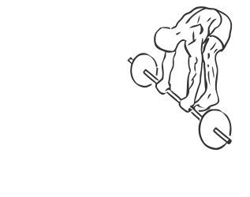
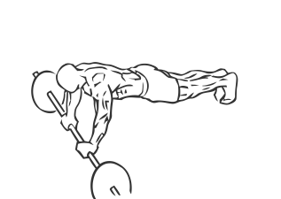

# Ab Rollout with Barbell

> This exercise works the abs and lower back and is the proper version of an “ab roller”.

``` 
id: 0285 
type: compound 
primary: abdominals 
secondary: erector spinae,deltoid 
equipment: barbell 
``` 


## Steps


 - Place a barbell on the floor at your feet.
 - Bending at the waist, grip the barbell with a shoulder with overhand grip.
 - With a slow controlled motion, roll the bar out so that your back is straight.
 - Keep your arms straight throughout the exercise.
 - Roll back up raising your hips and butt as you return to the starting position.
 - Note: Practice raising your hips and butt as high as you can with this exercise.

## Tips


## Images





