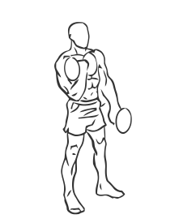
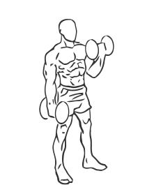

# Alternating Bicep Curl with Dumbbell

> This exercise is a single arm version of a biceps curl.

``` 
id: 0223 
type: isolation 
primary: biceps brachii 
secondary: forearm 
equipment: dumbbell 
``` 


## Steps


 - Steps
 - Stand with your feet shoulder width apart, your knees slightly bent and your abs drawn in.
 - Grasp a dumbbell in each hand so your palms are facing up.
 - Extend your arms so they are at the sides of your body.
 - Keeping your elbows locked lift your left arm to your chest so that your forearm touches your bicep.
 - Lower your arm and repeat with your right arm.
 - Note: Do not swing your body as you perform this exercise.

## Tips


## Images





