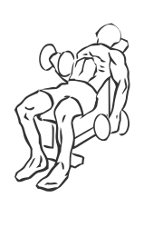
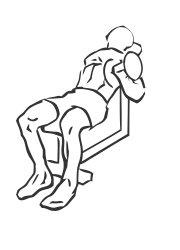

# Alternating Incline Curl with Dumbbell

> This exercise uses an incline bench to change your body’s position as you perform Biceps Curls.

``` 
id: 0214 
type: isolation 
primary: biceps brachii 
secondary:  
equipment: dumbbell 
``` 


## Steps


 - Adjust an incline bench to a 45 degree angle.
 - Grasp a dumbbell in each hand and sit back on the bench with your feet firmly planted on the floor.
 - Allow your arms to hang down at your sides.
 - Keeping your elbow straight, raise your right arm up towards your head.
 - In a controlled manner lower the weight and repeat with your left arm.

## Tips


## Images





