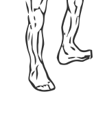
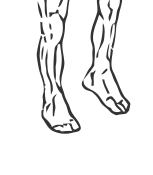

# Ankle Circles

> This is the most simple of all exercises for the calves.

``` 
id: 0270 
type: isolation 
primary: gastrocnemius,soleus 
secondary:  
equipment: body 
``` 


## Steps


 - Stand on one foot near a chair or wall for support.
 - Lift your foot off the ground and draw circles clockwise in the air with your toes.
 - Reverse the direction (counter-clockwise) as well as switch feet.

## Tips


## Images





