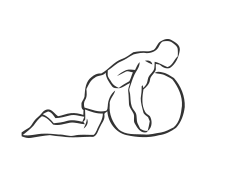
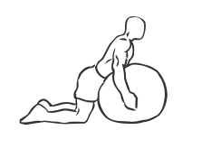

# Back Extension on Stability Ball

> This exercise provides flexibility as it strengthens the muscles of the back and core.

``` 
id: 0104 
type: isolation 
primary: erector spinae 
secondary: core,ischiocrural muscles 
equipment: exercise ball 
``` 


## Steps


 - Lie prone (on your stomach) on a Stability Ball with your toes firmly planted on the floor for balance.
 - With your hands across your chest or at your ears, raise your chest off the ball so you are hyperextending your spine.
 - Slowly return your chest to the ball.
 - Repeat.

## Tips


## Images





