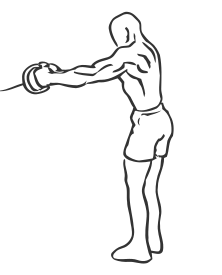
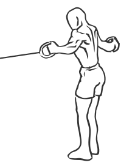

# Back Fly's with Exercise Band

> This is an exercise for shoulder, middle back and triceps strengthening.

``` 
id: 0020 
type: isolation 
primary: deltoid 
secondary: triceps brachii,latissimus dorsi 
equipment: exercise band 
``` 


## Steps


 - Place an exercise band around a post or machine at mid chest height.
 - Stand with your feet shoulder width apart, abs drawn in and knees slightly bent.
 - Stand back from the post so there is tension in the band, grasping the band with your arms extended in front of you and a slight bend in your elbows; this is your starting position.
 - Bring your arms back in a controlled motion till they are parallel at your sides and in line with your shoulders.
 - Slowly return your arms to the starting position in front of your chest.
 - Repeat.

## Tips


 - Maintain a good upright posture at all times during this exercise ensuring you do not arch your back.

## Images





