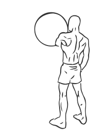
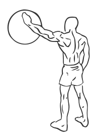

# Ball Wall Circles

> This is an exercise to strengthen and stretch the rotator cuff muscles or shoulder muscles.

``` 
id: 0019 
type: compound 
primary: deltoid 
secondary: biceps brachii,triceps brachii 
equipment: swiss ball 
``` 


## Steps


 - Stand upright with your feet shoulder width apart.
 - Place a Swiss ball at chest height against a wall and with your left hand, roll the ball in small circles against the wall.
 - Keep your arm fully extended with a slight bend in the elbow.
 - Reverse the direction of the circles.
 - Switch arms.

## Tips


 - Maintain a good upright posture throughout this exercise.
 - Ensure the swiss ball is inflated enough to allow for smooth rhythmical circles.

## Images





