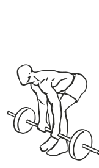
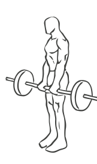

# Dead Lifts: Barbell

> The techniques is identical to that of the Smith Machine dead lift except for the fact that this exercise provides less support.

``` 
id: 0099 
type: isolation 
primary: erector spinae 
secondary: ischiocrural muscles,gastrocnemius,soleus 
equipment: barbell 
``` 


## Steps


 - Stand with your feet shoulder width apart so that your feet are under the bar.
 - Keeping your back straight bend at the waist, allow some bend in your knees.
 - Grasp the par with an overhand grip approximately 16 inches apart.
 - Straighten your back as you hold the bar at arm’s length.
 - Bend over again lowering the bar to just above the floor.

## Tips


 - This is an advanced exercise and should be perfected first with the Smith Machine.

## Images





