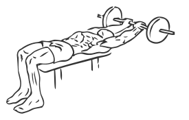
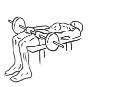

# Barbell Front Raise and Pullover

> This is an exercise for chest, triceps and shoulder strengthening.

``` 
id: 0058 
type: isolation 
primary: pectoralis major 
secondary: triceps brachii,deltoid 
equipment: barbell, flat bench 
``` 


## Steps


 - Lie on a flat bench and grasp a barbell using a medium grip (about 15” apart).
 - Place the barbell on your upper thighs and lock your arms straight with a slight bend in your elbows.
 - Draw your abs in and keeping your back flat on the bench, raise your arms up in an arc over and behind your head (as if you were performing a reverse pullover).
 - Slowly return the barbell to the starting position on your thighs.

## Tips


## Images





