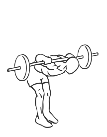

# Good Mornings: Barbell

> This is one of the oldest exercises in bodybuilding but it still is one of the best for working the lower back.

``` 
id: 0101 
type: isolation 
primary: erector spinae 
secondary: ischiocrural muscles 
equipment: barbell 
``` 


## Steps


 - Place a barbell across your shoulders.
 - Keeping your head up and your back completely straight, bend at the waist until your back is parallel with the floor.
 - Return to starting position.
 - Repeat.

## Tips


## Images




