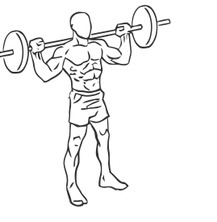
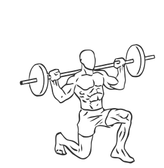

# Lunges: Barbell

> This is a classic exercise used for strengthening the hamstrings, quadriceps, calves and gluts.

``` 
id: 0114 
type: isolation 
primary: ischiocrural muscles 
secondary: glutaeus maximus,quadriceps,gastrocnemius,soleus 
equipment: barbell 
``` 


## Steps


 - Start by placing a barbell across your upper back, using a grip slightly wider than your shoulders.
 - Stand with your feet about 8 inches apart, toes facing forward.
 - Take a step forward (2-3 feet) keeping your abs drawn in and your upper body straight.
 - Slowly lower one knee down as if kneeling while keeping your other knee bent at a 90 degree angle, do not let your knee touch the ground.
 - Lower your body so that your rear knee is just above the floor and hold for a moment before returning to the starting position.
 - Repeat on other side.

## Tips


 - Your front knee should never go past the toes of that foot and should remain at a 90 degree angle in order, to prevent knee injury.

## Images





