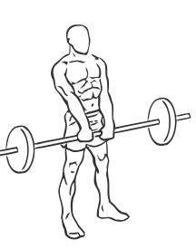
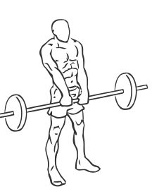

# Barbell Shrugs

> This is an exercise for trapezius strengthening.

``` 
id: 0030 
type: isolation 
primary: trapezius 
secondary:  
equipment: barbell 
``` 


## Steps


 - Stand on the floor with your abs drawn in and your back straight.
 - Grasp a barbell with a grip a little wider than shoulder width at arms length.
 - Drop your shoulders as much as possible to start.
 - Raise your shoulder as high as possible.
 - Pause for a moment at the top and then return to starting position in a controlled motion.
 - Repeat.

## Tips


 - Do not arch your back at all during the exercise.

## Images





