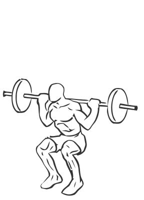
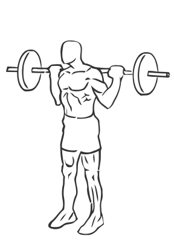

# Barbell Squat

> 

``` 
id: 0122 
type: compound 
primary: quadriceps 
secondary: ischiocrural muscles 
equipment: barbell 
``` 


## Steps


 - This is an exercise for leg strengthening, mainly the quadriceps.
 - Lifting a barbell off of a weight rack, position it on your shoulders.
 - Place your feet slightly wider than shoulder width apart with your knees and toes pointed slightly outward.
 - Drawing your abs in descend slowly by bending at the knees and hips as if you are sitting down (squatting).
 - Lower yourself as far as you can control without letting your body shift towards your toes (this will cause you to loose balance).
 - Pause in the downward position and slowly return upright to the starting position.

## Tips


## Images





