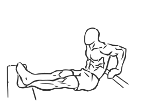
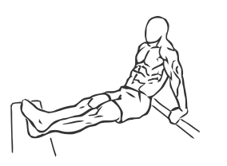

# Bench Dips

> This exercise is one of the most basic and still one of the best for building the triceps.

``` 
id: 0162 
type: compound 
primary: triceps brachii 
secondary: pectoralis major 
equipment: body 
``` 


## Steps


 - This exercise is one of the most basic and still one of the best for building the triceps (muscles on the back of the arm).
 - Place two benches parallel to each other 3-4 feet apart.
 - Sit on one bench and place your feet on the edge of the other bench so that your legs are suspended between the 2 benches.
 - Cross your feet for support.
 - Hold onto the bench with your hands for support and slowly lower body towards the floor by bending your elbows.
 - Pause and then return to starting position.
 - Note: Do not go below a 90 degree angle as this can cause on your shoulders.

## Tips


## Images





