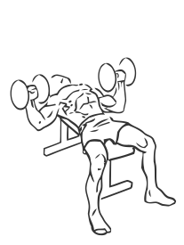
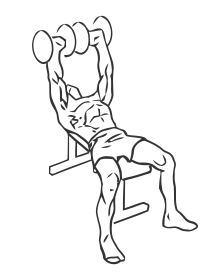

# Bench Press: Dumbbell

> This is  an exercise for chest,triceps and shoulder strengthening.

``` 
id: 0055 
type: isolation 
primary: pectoralis major 
secondary: deltoid,triceps brachii 
equipment: dumbbells, flat bench 
``` 


## Steps


 - This is an exercise for chest, triceps and shoulder strengthening.
 - Grasp the dumbbells in each hand and lie on a flat bench with your feet firmly on the ground.
 - Extend your arms up over your chest with your palms facing forwards.
 - Press the dumbbells up over your chest till your arm are fully extended this is your starting position.
 - Bend your elbows to a 90 degree angle so your upper arms are parallel with the floor.
 - Slowly lower the dumbbells as low as comfortable along your chest.
 - With a controlled motion return back to your starting position.
 - Repeat.

## Tips


## Images





