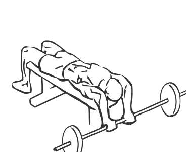
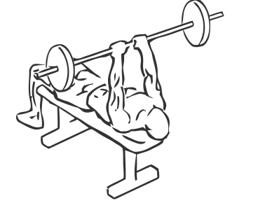

# Bent Arm Pullover

> This is an exercise for chest, triceps, shoulders and lats strengthening.

``` 
id: 0045 
type: isolation 
primary: pectoralis major 
secondary: latissimus dorsi,deltoid,triceps brachii 
equipment: barbell, flat bench 
``` 


## Steps


 - Lie flat on a bench with your head hanging slightly over the end and your feet flat on the floor.
 - Hold a barbell with a close grip (approximately 14”), keep your elbows in throughout the exercise.
 - Starting with your arms fully extended over your chest, slowly lower the bar in an arc over your head and towards the floor.
 - Pull the bar back up to chest height in a slow controlled manner and return to starting position.
 - Repeat.

## Tips


## Images





