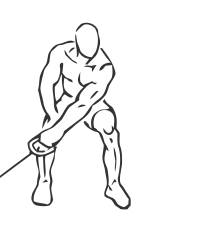
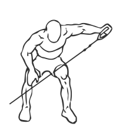

# Bent-over Lateral Cable Raises

> This is an exercise for shoulder, trapezius and middle back strengthening.

``` 
id: 0017 
type: isolation 
primary: deltoid 
secondary: trapezius,latissimus dorsi 
equipment: cable 
``` 


## Steps


 - Grasp the handle of the low pulley with your right hand.
 - Bend forward from the waist; your upper body should be nearly parallel with the floor. Bend your knees slightly and place your left hand on your left thigh. Let your right arm hang from your shoulder in front of you with your elbow slightly bent. This is your starting position.
 - Lift your right arm, keeping your elbow slightly bent.
 - Keep moving your arm until it is parallel to the floor, in line with your right ear.
 - Slowly bring the weight back down to the starting position.
 - Perform exercise on left arm and then repeat.

## Tips


 - Start with a lower weight in order to perfect the technique.
 - Ensure your back remains straight throughout this exercise in order to prevent injury.

## Images





