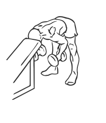
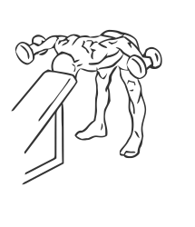

# Bent Over Rear Deltoid Raise With Head On Bench

> This is an exercise for shoulder strengthening.

``` 
id: 0032 
type: isolation 
primary: deltoid 
secondary:  
equipment: dumbbells 
``` 


## Steps


 - Rest your forehead on an incline bench in oder to stabilise your movements so you are bent over with your back parallel to the floor, draw your abs in.
 - Grasp dumbbells in your hands with your arms straight and elbows slightly bent ensuring they are not locked.
 - Slowly raise the dumbbells up to shoulder height.
 - Pause for a moment and then return to the starting position.
 - Repeat.

## Tips


 - ensure your back is straight and parallel to the floor throughout the exercise.

## Images





