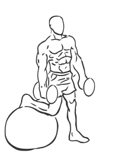
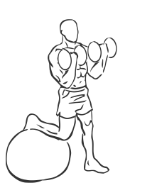

# Biceps Curl: Stability Ball with Dumbbell (leg raised)

> This exercise incorporates balance along with a bicep curl.

``` 
id: 0263 
type: isolation 
primary: biceps brachii 
secondary: ischiocrural muscles,forearm,quadriceps,gastrocnemius,soleus 
equipment: dumbbell, stability Ball 
``` 


## Steps


 - Grasp a dumbbell in each hand with a palms up grip.
 - Place the top of one foot behind you on a Stability Ball (see illustration) as if you were stretching your leg.
 - Keep your back straight and your abs drawn in.
 - Bring your arms down in front of your legs.
 - Raise your arms up, curling and contracting your biceps.
 - Lower your arms and return to starting position and switch legs.

## Tips


## Images





