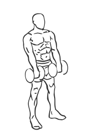
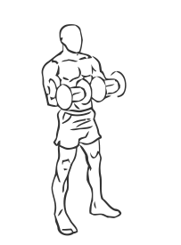

# Biceps Curl: Dumbbell (Reverse)

> This is a reverse curl exercise that works all of the muscles of the arms.

``` 
id: 0257 
type: isolation 
primary: biceps brachii 
secondary: forearm 
equipment: dumbbell 
``` 


## Steps


 - Stand with your feet shoulder width apart, your knees slightly bent and your abs drawn in.
 - Grasp a dumbbell in each hand with palms facing down.
 - Keeping your arms at your side your elbows steady, lift the dumbbells up towards your shoulders.
 - Pause for a moment and then return to the starting position.

## Tips


## Images





