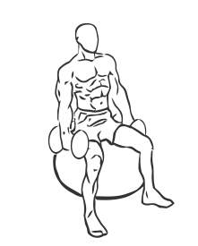

# Biceps Curl: Stability Ball with Dumbbell (seated)

> This version of a biceps curl uses a Stability Ball.

``` 
id: 0255 
type: isolation 
primary: biceps brachii 
secondary: forearm 
equipment: dumbbell 
``` 


## Steps


 - This version of a biceps curl uses a Stability Ball. Exercises preformed with Stability Balls encourage better posture and core muscle development.
 - Grasp a dumbbell in each hand while sitting on a Stability Ball with your feet placed firmly in front of you, and your abs drawn in.
 - Keeping your elbows at your side and your back straight, curl your arms up to your chest.
 - Pause for a moment, contracting your biceps.
 - Slowly lower your arms to the starting position.

## Tips


## Images




