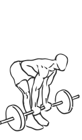
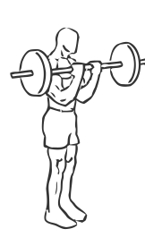

# Dead Lift: Barbell (Biceps Curl)

> This exercise combines a bicep curl with a deadlift.

``` 
id: 0259 
type: isolation 
primary: biceps brachii 
secondary: gastrocnemius,soleus,erector spinae,ischiocrural muscles 
equipment: barbell 
``` 


## Steps


 - This is an advanced exercise. This exercise combines a bicep curl with a deadlift.
 - Grasp an EZ Curl or barbell with palms facing up.
 - Standing with your feet shoulder width apart and your knees slightly bent, draw your abs in.
 - Extend your arms so the bar rests in front of your thighs.
 - Bending at the waist, bring the bar down to just above the floor.
 - As you return to a standing position, bring the bar up and curl your arms bringing your forearms to your biceps.
 - Return the starting position and repeat.
 - Note: Performing this exercise in front of a mirror may help you spot and correct your form.

## Tips


## Images





