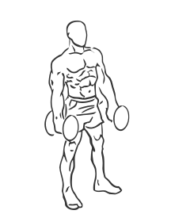
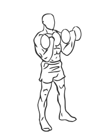

# Biceps Curl: Dumbbell

> This version of a biceps curl uses both arms at the same time.

``` 
id: 0224 
type: isolation 
primary: biceps brachii 
secondary: forearm 
equipment: dumbbell 
``` 


## Steps


 - Stand with our feet shoulder width apart, your knees slightly bent and your abs drawn in.
 - Grasp a dumbbell in each hand with your palms facing up.
 - Extend your arms so they are at the sides of your body.
 - Keeping your elbows, locked lift your arms to your chest so that your forearms touch your biceps.
 - In a slow controlled manner, lower your arms to the starting position.
 - Note: Do not swing your body as you perform this exercise.

## Tips


## Images





