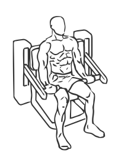
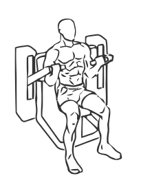

# Biceps Curl: Machine

> This exercise uses a machine to insure proper form.

``` 
id: 0253 
type: isolation 
primary: biceps brachii 
secondary: forearm 
equipment: machine 
``` 


## Steps


 - Adjust the seat of the machine so your elbows are correctly aligned with the rotation axis.
 - Press your arms against the pads and keep them stationary throughout the exercise.
 - Curl your forearms until your arms are fully flexed.
 - Slowly lower your arms back to the starting position.

## Tips


## Images





