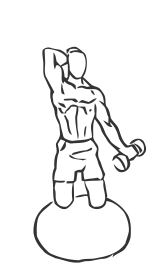
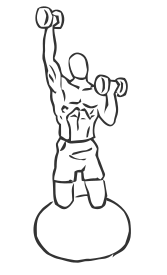

# Biceps Curl: Stability Ball with Dumbbell (Overhead Extension)

> This exercise requires you to be able to balance kneeling on a stability ball before you can correctly perform this exercise

``` 
id: 0260 
type: isolation 
primary: triceps brachii,biceps brachii 
secondary: forearm,should 
equipment: dumbbell 
``` 


## Steps


 - This is an advanced exercise. This exercise requires you to be able to balance kneeling on a stability ball before you can correctly perform this exercise.
 - Grasp a dumbbell in each hand with palms facing up.
 - Kneel on a Stability Ball, drawing your abs in and keeping your back straight.
 - Raise one arm up over your shoulder and keep your other arm curled.
 - Bend your raised arm back as if performing a triceps extension while lowering your other arm and curling it back.
 - Return to starting position and repeat arms.
 - Note: Work with a Personal Trainer or Instructor to learn how to safely perform this exercise.

## Tips


## Images





