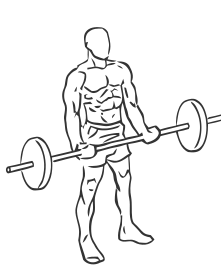
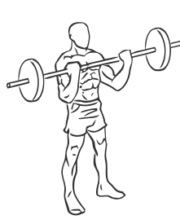

# Biceps Curl: Barbell

> This is a basic exercise for the biceps.

``` 
id: 0211 
type: isolation 
primary: biceps brachii 
secondary: deltoid,forearm 
equipment: barbell 
``` 


## Steps


 - This is a basic exercise for the biceps (arms).
 - Stand with your feet shoulder width apart, your knees slightly bent and your abs drawn in.
 - Grasp a barbell with palms facing up, approximately shoulder width apart.
 - Lower your arms fully to above your thighs and bending only your elbows, raise the bar to your upper chest.
 - Pause for a moment and then return to the starting position.
 - Note: Do not swing your hips or back during this exercise.

## Tips


## Images





