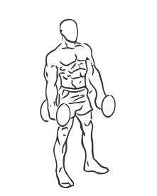
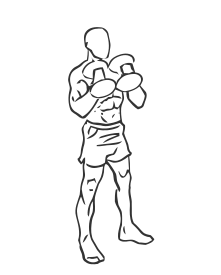

# Biceps Curl: Dumbbell (Hammer)

> This exercise uses a hammering motion to isolate the biceps.

``` 
id: 0227 
type: isolation 
primary: biceps brachii 
secondary:  
equipment: dumbbell 
``` 


## Steps


 - This exercise uses a hammering (up and down) motion to isolate the biceps.
 -  Stand with your feet shoulder width apart, your knees slightly bent and your abs drawn in.
 - Grasp a dumbbell in each hand so your palms are facing each other.
 - Extend your arms so they are at the sides of your body.
 - Keeping your elbows locked lift your arms in an arc towards your shoulders.
 - Lower your arms in a steady controlled motion and repeat.
 - Note: Do not turn your wrists during this exercise.

## Tips


## Images





