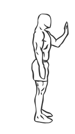
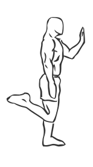

# Body Leg Lifts

> This is an exercise for gluts and hamstring strengthening.

``` 
id: 0111 
type: isolation 
primary: glutaeus maximus 
secondary: ischiocrural muscles 
equipment: body 
``` 


## Steps


 - Using a post or tall weight bench for balance stand straight with your abs drawn in.
 - Raise one off the ground and behind you while standing on the other leg.
 - Slowly lower the leg and raise it again while flexing the gluts.
 - Repeat with your other leg.

## Tips


## Images





