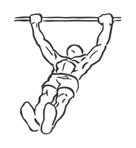
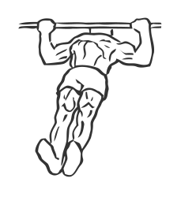

# Body Row

> This is a good overall exercise which strengthens your chest, core and back muscles.

``` 
id: 0086 
type: compound 
primary: pectoralis major 
secondary: core,trapezius,back 
equipment: bar 
``` 


## Steps


 - Lie under a bar so that the bar is at mid chest level and your feet are firmly on the floor.
 - Draw your abs in and keep your back flat.
 - Using your arms, lift and row your body towards the bar.
 - Pause for a moment and with slow controlled movements lower your self back to starting position.
 - Repeat.

## Tips


## Images





