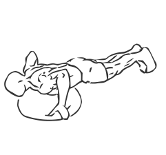
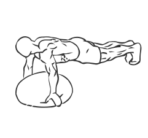

# Push Up: Bosu Ball

> This is an exercise for chest, core, shoulders and triceps strengthening with the use of a Bosu ball.

``` 
id: 0069 
type: isolation 
primary: pectoralis major 
secondary: deltoid,core,triceps brachii 
equipment: bosu ball 
``` 


## Steps


 - Place the Bosu ball flat side down on the floor.
 - Kneel on the floor with your arms fully extended on the ball, and body straight.
 - Keeping your abs drawn in and your body straight, by bending your elbows lower your chest to the ball.
 - Pause for a moment and then return to starting position.
 - Repeat.

## Tips


 - Ensure your elbows remain close to your body while lowering your chest to the ball.
 - Beginners may want to start on your knees with your feet off the ground so you are rocking into the Push Up.

## Images





