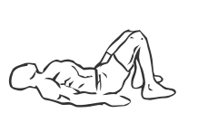
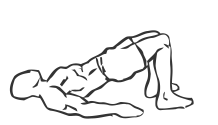

# Bridging

> This is an excellent exercise for strengthening and maintaining the core muscles.

``` 
id: 0109 
type: isolation 
primary: glutaeus maximus 
secondary: core 
equipment: body 
``` 


## Steps


 - Lie on your back with your knees bent and your feet flat on the floor.
 - Lift up hips and bum off the floor as you draw your abs in and keep your gluts tight.

## Tips


## Images





