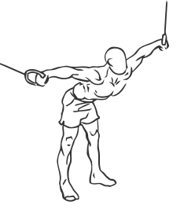
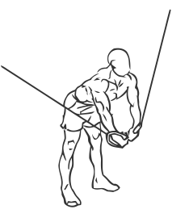

# Cable Crossover

> This is an exercise for chest and shoulder strengthening.

``` 
id: 0048 
type: isolation 
primary: pectoralis major 
secondary: deltoid 
equipment: cable 
``` 


## Steps


 - Attach the cable pulley to shoulder height.
 - Grasp the pulley in both hands and stand approximately one foot in front of the weight stacks, with one foot slightly in front of the other.
 - With a slight bend in your elbows bring your hand together in front of your chest on downward angle.
 - When your hands meet at the midpoint of your chest, hold for a moment.
 - With a slow controlled motion return to starting position.

## Tips


## Images





