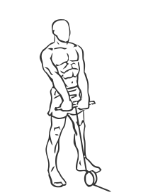
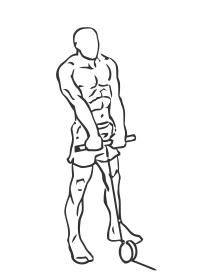

# Shoulder Shrugs: Cable

> An exercise for trapezius strengthening.

``` 
id: 0009 
type: isolation 
primary: trapezius 
secondary: deltoid 
equipment: cable 
``` 


## Steps


 - Attach a pulley to the lowest setting on cable machine.
 - Stand with your feet shoulder width apart, your abs drawn and your back straight.
 - Start with the pulley at waist height.
 - Grasp the pulley and shrug your shoulders up while keeping your arms extended.
 - Hold this position for a moment then with a controlled motion return to the starting position of the pulley to waist height.

## Tips


 - Bend your knees slightly when standing.

## Images





