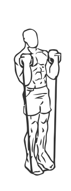
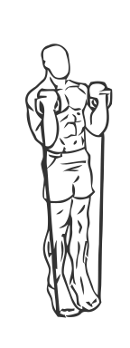

# Calf Raises with Band

> 

``` 
id: 0274 
type: isolation 
primary: gastrocnemius,soleus 
secondary:  
equipment: exercise band 
``` 


## Steps


 - This exercise uses a band to create resistance.
 - Stand with your toes on an exercise band and raise the handles up to your shoulders.
 - Raise up on your toes, keeping your hands up by your shoulders.
 - Pause for a moment and then lower your heel to the floor.
 - Repeat.

## Tips


## Images





