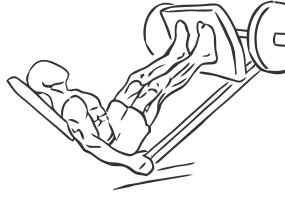
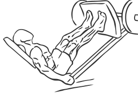

# Calves Press on Leg Machine

> This exercise uses a Leg Press Machine to work your calves.

``` 
id: 0273 
type: isolation 
primary: gastrocnemius,soleus 
secondary:  
equipment: machine 
``` 


## Steps


 - This exercise uses a Leg Press Machine to work your calves. You can perform this exercise along with Leg Presses.
 - Sit down on a Leg Press Machine and press the plate up as if you were performing a leg press.
 - Slide your feet down so that the balls of your feet are pressing against the rack (with your heels hanging free).
 - Keeping the handles locked, press up and flex your toes and then slowly bring your toes back towards your body.
 - Perform theses movements slowly for maximum benefit.
 - Note: Use a lighter weight on this exercise than you are able to lift with a leg press until you are familiar with the movements.

## Tips


## Images





