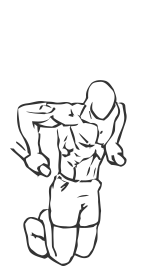
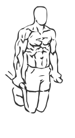

# Chest Dips

> This is an exercise for chest, triceps and shoulder strengthening.

``` 
id: 0054 
type: isolation 
primary: pectoralis major 
secondary: triceps brachii,deltoid 
equipment: body, parallel bars 
``` 


## Steps


 - Stand in between the parallel bars.
 - Grip the handles of the parallel bars and push yourself up to the starting position with straightened arms.
 - With your elbows close to your body keep your hips straight, lower your body forward by bending your elbows so your chest is leading as you go down.
 - Raise yourself back up to the starting position and repeat.
 - Repeat.

## Tips


 - Ensure not to lock your elbows once you have raised yourself up.

## Images





