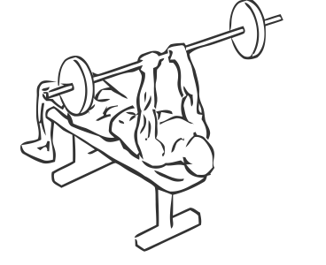

# Bench Press: Barbell (Close Grip)

> This is an exercise for chest, triceps and shoulder strengthening.

``` 
id: 0049 
type: isolation 
primary: pectoralis major 
secondary: triceps brachii,deltoid 
equipment: barbell 
``` 


## Steps


 - Lie on a flat bench with your feet flat on the floor, keep your back flat on the bench.
 - Grasp the bar a close grip (approximately 14” apart).
 - Raise the barbell above your body and move it over the middle of your chest, this is your starting position.
 - Lower the bar down so it just touches your chest.
 - Raise the bar till your arms are fully extended and your elbows are locked.
 - Return to starting position.

## Tips


## Images




