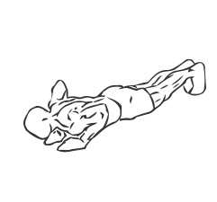
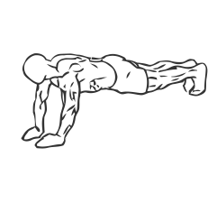

# Close Triceps Pushup

> This version of the Pushup isolates the tricep muscles.

``` 
id: 0188 
type: compound 
primary: triceps brachii 
secondary: pectoralis major 
equipment: body 
``` 


## Steps


 - This version of the Pushup isolates the tricep (back of the arm) muscles.
 - Kneel down on the floor or a mat, placing your hand thumbs together and raise your up on your toes.
 - Draw your abs in and keep your back and neck in a straight line.
 - Slowly lower your body towards the floor, by bending your arms, until you are nearly touching the floor.
 - In a controlled manner raise your body back up to the starting position.

## Tips


## Images





