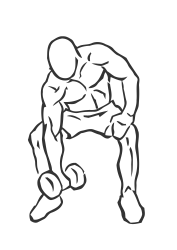
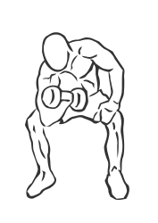

# Concentration Curls with Dumbbell

> Concentration exercises limit your range of movement to increase the effectiveness of the movement.

``` 
id: 0220 
type: isolation 
primary: biceps brachii 
secondary: forearm 
equipment: dumbbell 
``` 


## Steps


 - Sit on the end of a flat bench with your feet flat and your legs spread apart.
 - Grasp a dumbbell in your hand, palms facing up.
 - With your elbow pressed against your inner thigh, curl the dumbbell up towards your chest.
 - Slowly return to the starting position.
 - Repeat and switch arms.
 - Note: Keep all of your body still except the arm you are exercising.

## Tips


## Images





