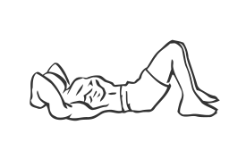
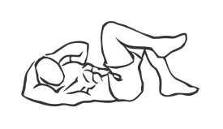

# Cross Body Crunch

> This version of the crunch works both the upper and lower portion of the abs.

``` 
id: 0289 
type: compound 
primary: abdominals 
secondary:  
equipment: body 
``` 


## Steps


 - Lie on your back and bring your knees up to a 60 degree angle, keep your feet flat on the floor.
 - Place your hands on either side of your head (over your ears).
 - Curl up raising your right elbow and your left knee so that they touch over your chest.
 - Return to the starting position and repeat with alternate arms and legs.
 - Note: Contract your abs as you twist during this exercise.

## Tips


## Images





