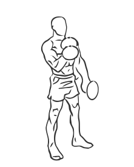
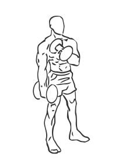

# Cross Body Hammer Curl with Dumbbell

> This exercise targets the biceps using a crossing motion rather than a standard curl.

``` 
id: 0221 
type: isolation 
primary: biceps brachii 
secondary: forearm 
equipment: dumbbell 
``` 


## Steps


 - While standing, grab a dumbbell in each arm with palms facing in.
 - Keeping your palms facing in (and not twisting your arms) curl the dumbbell up towards your opposite shoulder.
 - Bring the top of dumbbell up to and touching the shoulder.
 - Slowly with a controlled manner, lower the dumbbell back to the starting position.

## Tips


## Images





