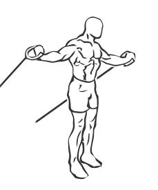
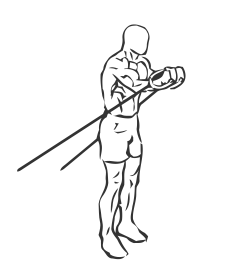

# Crossover with Bands

> This is an exercise for chest, biceps and shoulder strengthening

``` 
id: 0050 
type: isolation 
primary: pectoralis major 
secondary: deltoid,biceps brachii 
equipment: exercise band 
``` 


## Steps


 - This is an exercise for chest, biceps and shoulder strengthening.
 - Secure an exercise to a post (or secure pole) and hold it in each hand.
 - Step forward so the band has some tension, facing away from the post.
 -  Your arms at mid chest height and out to the side, palms facing forward this is your starting position.
 - Bring your hands together in front of you.
 - Hold this for a moment and then in a controlled motion return to starting position.

## Tips


 - Keep your arms straight with a slight bend in your elbows throughout this exercise.

## Images





