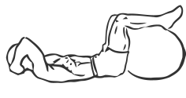
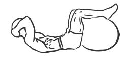

# Crunches with Legs on Stability Ball

> This exercise uses a Stability Ball as the base during your crunches.

``` 
id: 0290 
type: isolation 
primary: abdominals 
secondary:  
equipment: stability ball 
``` 


## Steps


 - Lie on your back and place your feet up on a stability ball.
 - Place your hands across your chest, or on either side of your head.
 - Keeping the small of your back on the floor, raise your head, shoulders and chest up and off the floor.
 - Pause for a moment contracting your abs and then return to the starting position.
 - Note: Take your time and perform this exercise in a slow controlled manner.

## Tips


## Images





