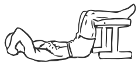
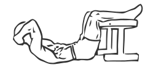

# Crunches

> 

``` 
id: 0291 
type: isolation 
primary: abdominals 
secondary:  
equipment: body 
``` 


## Steps


 - This is the most common abdominal exercise and possibly the most often improperly performed. Here is how to perform it correctly.
 - Lie on your back with your feet up on a bench and your knees bent at a 90 degree angle.
 - Place your hands across your chest or on either side of your head (over your ears).
 - Raise your head, shoulders and chest off the floor and towards your knees, crunching your abs.
 - Hold the position for a moment and then lower to the starting position.
 - Note: Keep your hips straight and your lower back against the floor during this exercise.

## Tips


## Images





