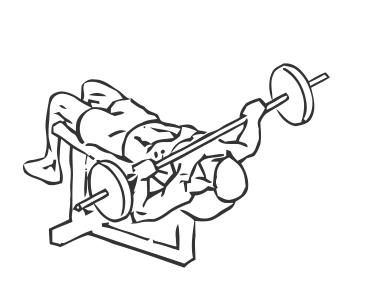
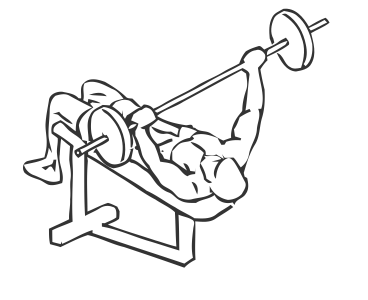

# Bench Press: Barbell (Decline)

> This is an exercise for chest, triceps and shoulder strengthening.

``` 
id: 0051 
type: isolation 
primary: pectoralis major 
secondary: triceps brachii,deltoid 
equipment: bench: decline, barbell 
``` 


## Steps


 - Lie on a decline bench with your head lower than your feet.
 - Grasp the bar at a grip 3-6 inches wider than your shoulders.
 - Raise the bar above your chest, keeping your elbows close in.
 - Slowly and with control lower the bar straight to your lower chest.
 - Raise the bar back up to starting position with the bar just above your chest.
 - Repeat.

## Tips


## Images





