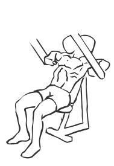
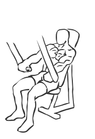

# Decline Chest Press

> This is an exercise for the strengthening of the lower chest or pectoral muscles and is preferred by beginners as it provides support and stability.

``` 
id: 0085 
type: isolation 
primary: pectoralis major 
secondary: deltoid,triceps brachii 
equipment: machine: chest 
``` 


## Steps


 - Adjust the seat of the machine so that the handles are near the lower portion of your chest.
 - Slowly press the handles forward until your hands are fully extended, do not lock your elbows.
 - Pause for a moment and then with a controlled movement lower your hands back to starting position.

## Tips


## Images





