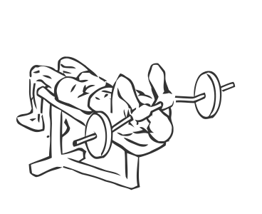
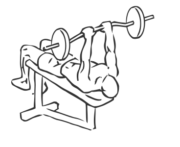

# Decline Close Grip Bench to Skull Crusher

> This exercise combines a close grip bench press with triceps extension.

``` 
id: 0168 
type: isolation 
primary: triceps brachii 
secondary: pectoralis major 
equipment: barbell 
``` 


## Steps


 - Lay with your back on a flat bench.
 - Grip a barbell with a close grip 8-12 inches apart.
 - Keeping your arms close to your sides lower the bar so it touches your chest, approximately an inch below your nipples.
 - Slowly return to starting position, concentrating on your triceps.
 - At the top of the exercise bend your arms down towards your head.
 - Raise the bar back up over your chest and repeat.

## Tips


## Images





