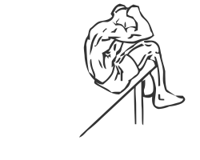

# Decline Crunch

> Using a decline crunch allows you keep your legs steady and isolate all of the abdominal muscles.

``` 
id: 0292 
type: isolation 
primary: abdominals 
secondary:  
equipment: body 
``` 


## Steps


 - Lie on a decline bench face up.
 - Place your feet securely under the pads.
 - Place your hands either across your chest or on either side of your head (over your ears).
 - Lay fully back and then rise slowly crunching your abs.
 - Pause for a moment and then return to the starting position.
 - Note: Use the full range of movement in this exercise for the optimal results.

## Tips


## Images




