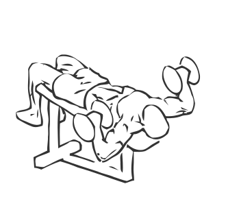
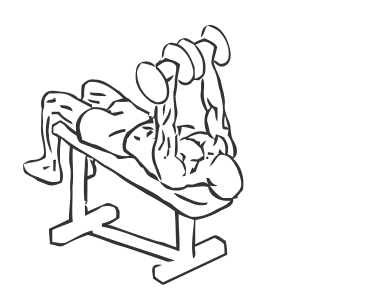

# Bench Press: Dumbbell (Decline)

> This is an exercise for chest, shoulder and triceps strengthening.

``` 
id: 0052 
type: isolation 
primary: pectoralis major 
secondary: triceps brachii,deltoid 
equipment: dumbbells, bench: decline 
``` 


## Steps


 - Grasp the dumbbells your hands and lie on a decline bench with your head lower than your feet.
 - Raise the dumbbells above your chest, bringing your elbows close in, this is your starting position.
 - Slowly and with control lower the dumbbells to either side of your lower chest.
 - Raise the dumbbells back up to starting position.

## Tips


## Images





